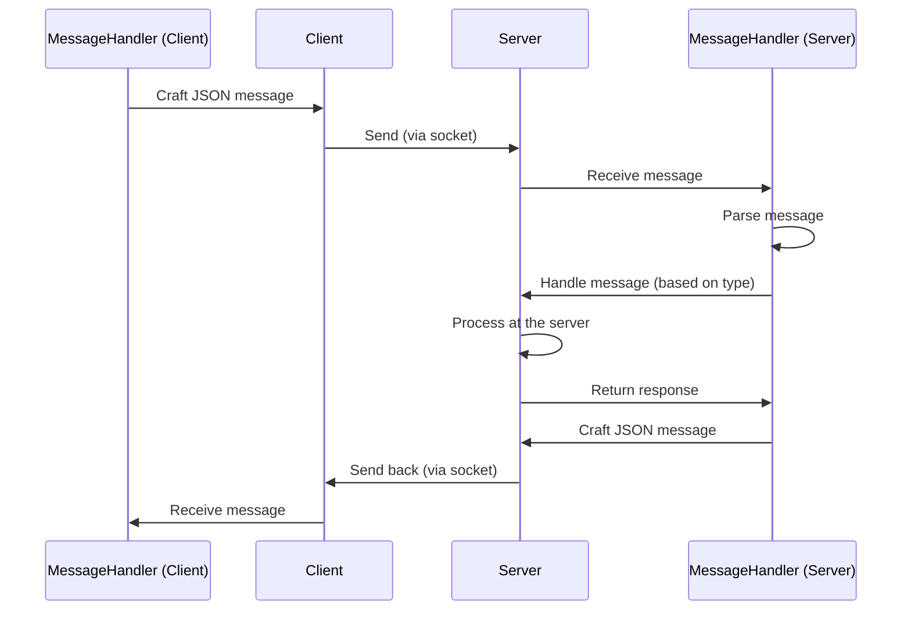

# [IT4062E] Network Programming | Final Project: Online Rubik's Cube Game

## Group 1 - Members
| Student Name | Student ID |
|--------------|------------|
| Nguyen Tieu Phuong     | 20210692     |
| Than Hai Phong   | 20210678     |
| Kieu Thai Thinh | 20215246     |

## Table of Contents

- [Folder Structure](#folder-structure)
- [Libraries Used](#libraries-used)
- [Running the Project](#running-the-project)
- [Server Setup and Processing](#server-setup-and-processing)
- [Message Handling](#message-handling)
- [Entity Models and Their Functions](#entity-models-and-their-functions)
- [Queries](#queries)
- [Database](#database)
- [Constants](#constants)

## Folder Structure

## Libraries Used

The project uses the following libraries located under the [`include`](include) folder:

- **nlohmann/json**: A JSON library for C++.
- **openssl**: A robust, full-featured open-source toolkit for the Transport Layer Security (TLS) and Secure Sockets Layer (SSL) protocols.

## Running the Project

To run the project, use the following commands:

```sh
make
./rubik-server
```

To clean the build directory, use:

```sh
make clean
./rubik-server
```

## Server Setup and Processing

The server setup and processing are handled in `server.cpp` and `main.cpp`. The server listens for client connections, reads messages, processes them using `MessageHandler`, and sends responses back to the clients.



Message flow from Client to Server.

## Message Handling

Messages are handled in `MessageHandler.cpp`. The MessageHandler class parses incoming JSON messages, delegates processing to the appropriate functions, and crafts JSON responses.

## Entity Models and Their Functions

### Admin
- `banPlayer(int player_id)`: Bans a player.
- `viewPlayerList()`: Views the list of players.
- `viewRoomList()`: Views the list of rooms.
- `spectate(int game_session_id, int room_id)`: Spectates a game session.
- `leaveGame(int room_id)`: Leaves a game.

### CubeState

Represents the state of a Rubik's cube during a game session.

### GameSession

- `createPlayerGameSessions(const vector<int>& playerIds, int cube_state_id)`: Creates player game sessions.
- `endGameSession(int player_id)`: Ends a game session.
### Player

- `createRoom(int max_players, int max_spectators)`: Creates a room.
- `joinRoom(int room_id, const char* participant_type)`: Joins a room.
- `viewRoomList()`: Views the list of available rooms.
- `updateCubeFromClient(string current_cube)`: Updates the cube state from the client.

### Room

- `startGameSession(int game_session_id, int player_id, string initial_cube_state)`: Starts a game session.
- `canStartGame()`: Checks if the game can start.
- `initCubeState()`: Initializes the cube state.

### RoomParticipant

- `leaveRoom()`: Leaves a room.
- `isReady(int room_id)`: Marks the participant as ready.

### UserService

- `signUp(const string& username, const string& password)`: Signs up a new user.
- `signIn(const string& username, const string& password)`: Signs in an existing user.

## Queries

The queries are defined in Query.cpp and include:

- **Admin Queries**
- **Player Queries**
- **Room Queries**
- **RoomParticipant Queries**
- **GameSession Queries**
- **PlayerGameSession Queries**
- **CubeState Queries**
- **GameMove Queries**
- **View and Index Definitions**

## Database

The database schema and queries are defined in `Query.cpp`. The database file is located at `Rubik.db`.

## Constants

Constants are defined in `Const.h` and include enums for player status, room status, room participant status, game session status, player game session status, and validation status. ```
